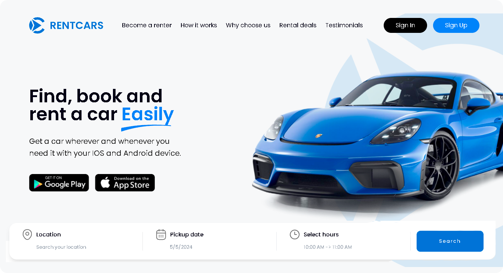

🌍 *[Português](README.md) ∙ [English](README-EN.md)*

<p align="center">
  
</p>

<h1 align="center">Rentcars - Landing Page</h1>

<div align="center">
  <strong>🚀 Find, book, and rent a car easily 📚</strong>
</div>


## 🔭 Overview

The Rentcars landing page was developed with the goal of presenting the car rental services offered by the company, highlighting its main features and benefits for customers. With a modern and intuitive design, the page provides a pleasant user experience, facilitating navigation and the acquisition of relevant information.

<p align="center">
  
</p>

> [!NOTE]
> This Landing Page is a **demonstrative project** created for portfolio purposes and showcasing development skills. Although it features **real brands**, there is no official association with these companies, and the car rental service described is **entirely fictitious**. This project is not intended to offer real car rental services and is used exclusively to demonstrate technical and creative competencies.

## 🔗 Links 

- ✨ The project can be viewed here: [Demo](https://rentcars-landing.netlify.app/)
- 🎨 Landing Page Prototype on Figma: [Here](https://www.figma.com/community/file/1343066637131946966/rent-car-landing-page)

## 💻 Technologies

- **TypeScript**: A JavaScript superset that adds static typing to the code, increasing development safety and predictability.
- **React.js**: Used for building the user interface, leveraging reusable components and efficient rendering.
- **Next.js**: Framework used for server-side rendering and static page generation, providing better performance and SEO.
- **Tailwind CSS**: CSS framework used for styling components, offering a class-based approach and facilitating responsive development.
- **Framer Motion**: Library for animations and gestures, used to enrich the user experience with fluid animations.
- **React Icons**: Library used to insert icons into the application in a simple and scalable way.
- **Next Image**: Component used to optimize image loading, improving page performance.

## ⚙️ Environment Setup

To run the project locally in a development environment, make sure you have Node.js and npm (or yarn) installed. Then, follow these steps:

1. Clone the project
   ```
   git clone https://github.com/rwbe/rentcars-landing
   ```
2. Navigate to the project directory:
   ```
   cd rentcars-landing
   ```
3. Install the dependencies using npm or yarn:
   ```
   npm install ou yarn install
   ```
4. Start the development server:
   ```
   npm run dev ou yarn dev
   ```
5. Open the application in your browser. By default, it will be available at:
   ```
   http://localhost:3000
   ```

## 📄 Credits and Acknowledgements

This project was inspired by the incredible work of **Truong Huy**, a talented UI/UX Designer whose prototype on Figma served as an essential foundation for the development of this landing page. I am deeply grateful for sharing his ideas and innovative design, which not only inspired me but also enabled this project to be made.

> Truong Huy
>(UI/UX Designer) - https://www.figma.com/@truong_huy / https://dribbble.com/Truonghuy10

## 📜 License

This project is licensed under the MIT License. See the LICENSE file for more information about licensing terms.

---
