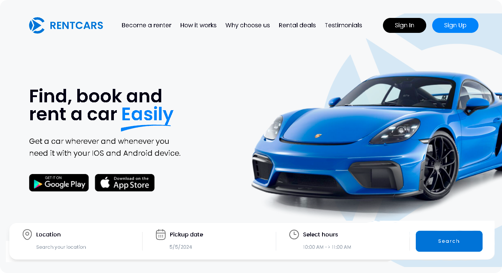

🌍 *[Português](README.md) ∙ [English](README-EN.md)*

<p align="center">
  
</p>

<h1 align="center">Rentcars - Landing Page</h1>

<div align="center">
  <strong>🚀 Encontre, reserve e alugue um carro facilmente 📚</strong>
</div>


## 🔭 Visão Geral

A landing page da Rentcars foi desenvolvida com o objetivo de apresentar os serviços de aluguel de carros oferecidos pela empresa, destacando seus principais recursos e benefícios para os clientes. Com um design moderno e intuitivo, a página proporciona uma experiência agradável ao usuário, facilitando a navegação e a obtenção de informações relevantes.

<p align="center">
  
</p>

> [!NOTE]
> Esta Landing Page é um **projeto demonstrativo** criado para fins de portfólio e apresentação de habilidades de desenvolvimento. Embora apresente marcas **reais**, não existe uma associação oficial com estas empresas, e o serviço de aluguel de carros descrito é **inteiramente fictício**. Este projeto não tem o objetivo de oferecer serviços reais de aluguel de carros e é utilizado exclusivamente para demonstrar competências técnicas e criativas.

## 🔗 Links 

- ✨ O projeto pode ser visualizado aqui: [Demo](https://www.rentcars-landing.netlify.com)
- 🎨 Protótipo da Landing Page no Figma: [Aqui](https://www.figma.com/community/file/1343066637131946966/rent-car-landing-page)

## 💻 Tecnologias

- **TypeScript**: Superset de JavaScript que adiciona tipagem estática ao código, aumentando a segurança e a previsibilidade do desenvolvimento.
- **React.js**: Utilizado para a construção da interface do usuário, aproveitando os componentes reutilizáveis e a renderização eficiente.
- **Next.js**: Framework utilizado para renderização do lado do servidor e geração de páginas estáticas, proporcionando melhor desempenho e SEO.
- **Tailwind CSS**: Framework CSS utilizado para estilização dos componentes, oferecendo uma abordagem baseada em classes e facilitando o desenvolvimento responsivo.
- **Framer Motion**: Biblioteca para animações e gestos, usada para enriquecer a experiência do usuário com animações fluidas.
- **React Icons**: Biblioteca utilizada para inserir ícones na aplicação de forma simples e escalável.
- **Next Image**: Componente utilizado para otimizar o carregamento de imagens, melhorando o desempenho da página.

## ⚙️ Configuração do Ambiente 

Para executar o projeto localmente em um ambiente de desenvolvimento, certifique-se de ter o Node.js e o npm (ou yarn) instalados. Em seguida, siga estas etapas:

1. Clone o projeto 
   ```
   git clone https://github.com/rwbe/rentcars-landing
   ```
2. Navegue até o diretório do projeto:
   ```
   cd rentcars-landing
   ```
3. Instale as dependências usando npm ou yarn:
   ```
   npm install ou yarn install
   ```
4. Inicie o servidor de desenvolvimento:
   ```
   npm run dev ou yarn dev
   ```
5. Abra a aplicação no seu navegador. Por padrão, ela estará disponível em:
   ```
   http://localhost:3000
   ```

## 📄 Créditos e Agradecimentos

Este projeto foi inspirado pelo incrível trabalho de **Truong Huy**, um talentoso UI/UX Designer cujo protótipo no Figma serviu como uma fundação essencial para o desenvolvimento desta landing page. Agradeço profundamente por compartilhar suas ideias e design inovador, que não só me inspirou, mas também permitiu que este projeto fosse feito.

> Truong Huy
>(UI/UX Designer) - https://www.figma.com/@truong_huy / https://dribbble.com/Truonghuy10

## 📜 Licença

Este projeto está licenciado sob a Licença MIT. Consulte o arquivo [LICENSE](LICENSE.txt) para obter mais informações sobre os termos de licenciamento.

---
